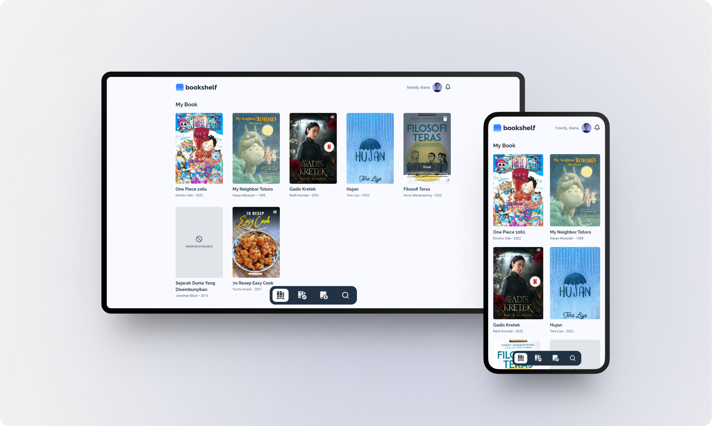

# Belajar Membuat Front-End Web untuk Pemula

## Submission: Aplikasi Pengelolaan Data Menggunakan DOM dan Web Storage

- [x] Mampu menambahkan data buku baru.
- [x] Memiliki minimal dua rak buku. Yakni **Belum selesai dibaca** dan **Selesai dibaca**.
- [x] Dapat memindahkan buku antar rak.
- [x] Dapat menghapus data buku.
- [x] Manfaatkan localStorage dalam menyimpan data buku.
- [x] Dapat melakukan pencarian buku. Hanya pada rak buku yang dipilih.
- [x] Responsive web design.

notes: aplikasi rak-buku ini memiliki nilai default yang nantinya akan tersimpan secara otomatis pada penyimpanan localStorage ketika user menambahkan buku atau memindahkannya ke rak lain.

